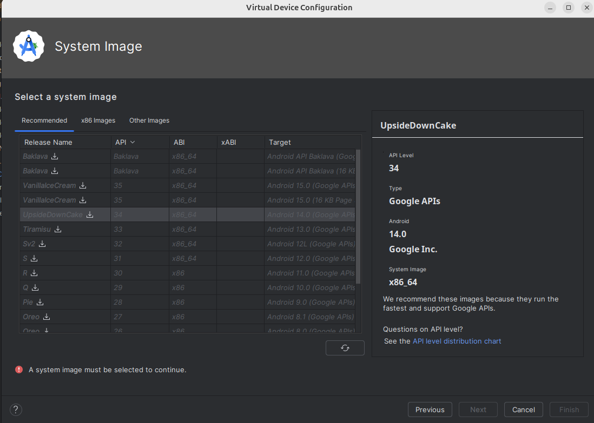
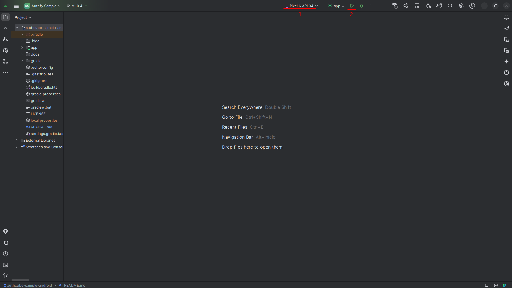
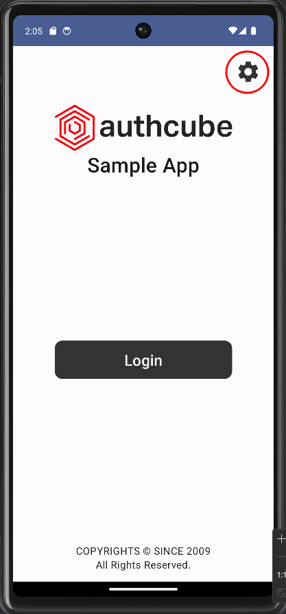
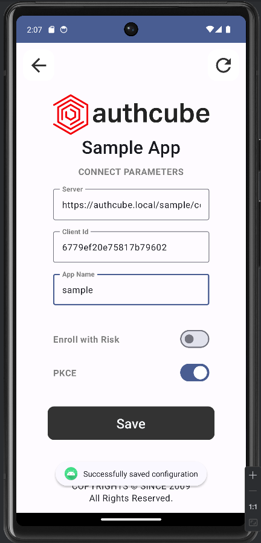

# 1. Introduction
This sample app lets you quickly test the integration of Authcube's Android SDK.

## License
This software is proprietary and protected under IT4YOU CONSULTORIA EM INFORMATICA LTDA's license.
All rights reserved since 2009.

Please refer to the LICENSE file in the repository for complete terms.

# 2. Running the app

### Prerequisites

Make sure you have installed:
- Git
- [Android Studio](https://developer.android.com/studio)

### Step 1: Clone this Repository
Run the following command in your terminal:

```bash
git clone https://github.com/authcube/sample-app-android.git
```

### Step 2: Open the Project
1. Open Android Studio
2. Click **"Open"** on the welcome screen (or go to **File > Open...** in the top menu)
3. Navigate to the directory where you cloned the project
4. Wait for the project to load (you'll see a progress bar at the bottom saying "Gradle Build Running")

### Step 3: Set Up and Configure the Emulator
1. Click on "Tools" in the top menu
2. Click "Device Manager"
3. Click the "Add a new device" button and "Create a new device"
4. In the "Phone" category, select Pixel 6 (or the any other phone)
5. Click "Next"
6. Select "API 34" (Android 14.0)
   - If it's not installed, click **install**
            
7. Finish the virtual device setup

### Step 4: Run the App
1. Select your newly created device in the top bar
2. Hit the `Run 'app'` button (or press **Shift + f10**)
   

# 3. Using the app
Before logging in, you **MUST** configure the app with identity provider details:
1. Click **Settings**
 


2. Fill in the fields with **your** information
 


3. Go back and log in. You'll be redirected to the **home screen**

## Troubleshooting
### If the build fails
Try these fixes in order:
1. Click **File > Sync Project with Gradle Files**
2. Click **Build > Clean Project** then **Build > Rebuild Project**
3. Close Android Studio and reopen it

### Additional help
- Make sure Android Studio is fully updated:
  1. Click **"Help"** in the top menu
  2. Click **"Check for updates"**
  3. Install any available updates

- If nothing else works, try:
  1. Close Android Studio
  2. Delete the .gradle/ directory from your project
  3. Reopen Android Studio and click the `Run 'app'` button
  4. Let it rebuild the app

### SDK Documentation

[Link](https://doc.sec4you.com.br/authfy-sdk/v2.5/pt-BR/) to SDK Documentation.

### Important Information
The Android Emulator is not aware of your local HOSTS configuration, so it is advised to use an 
external server to develop and test your app


